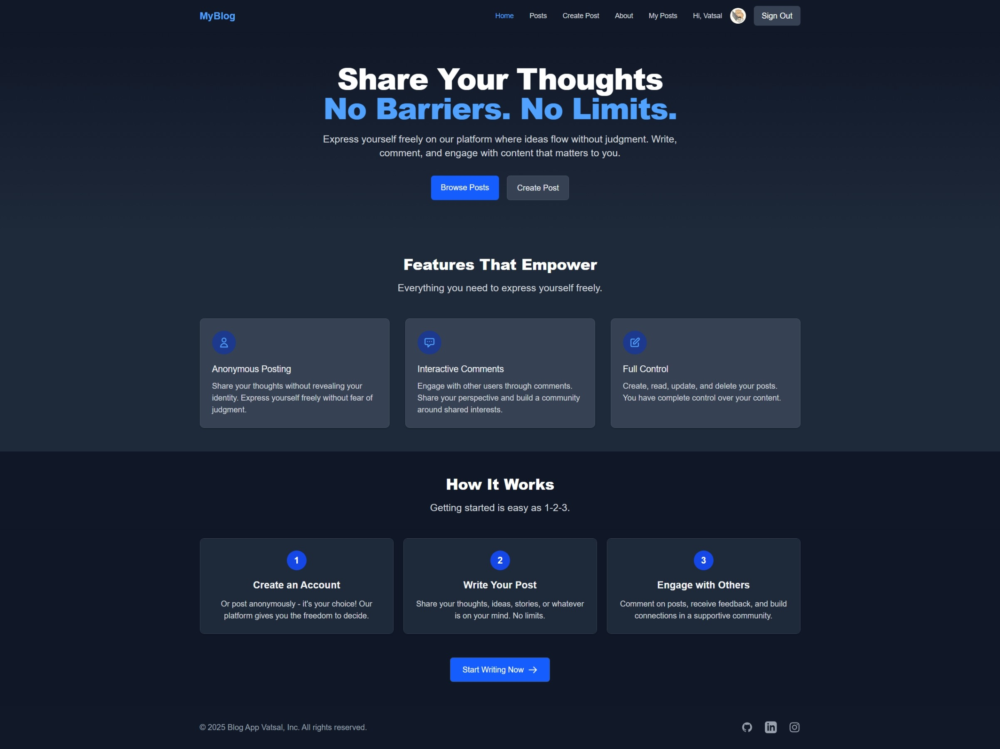
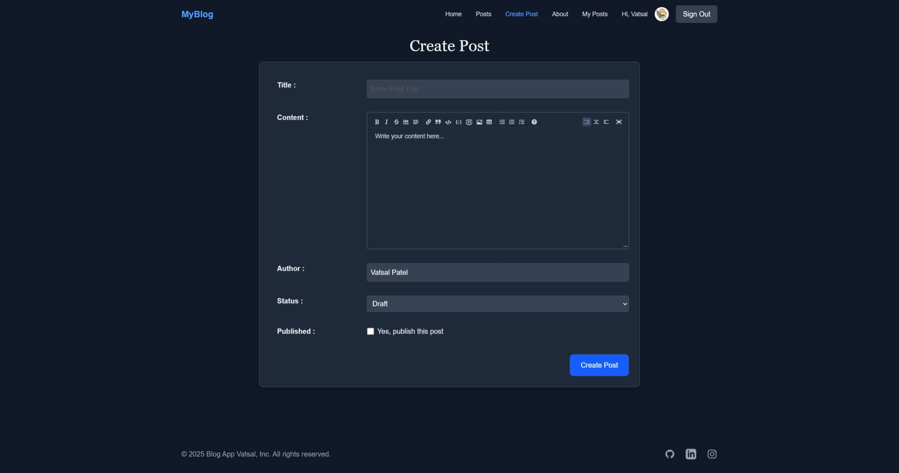
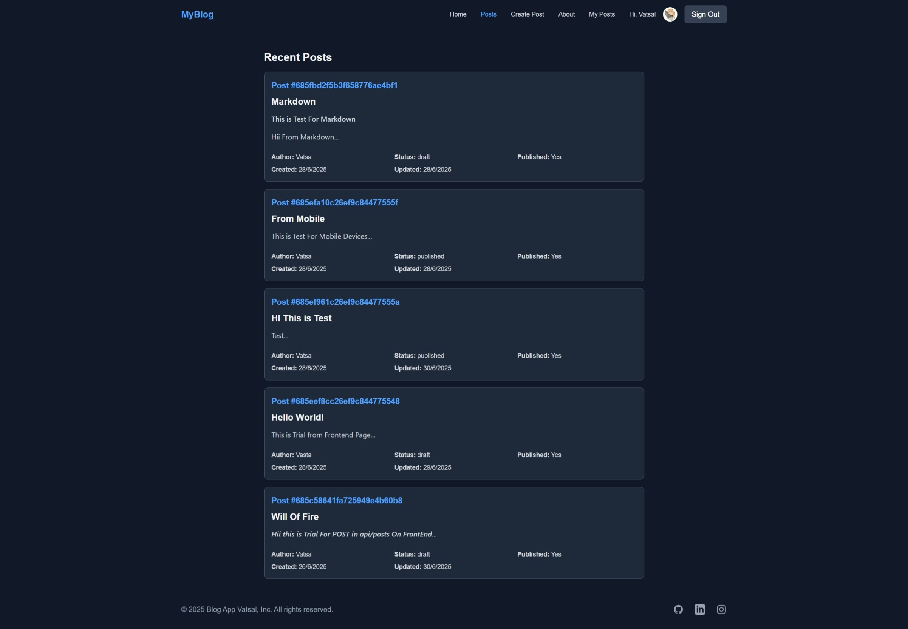
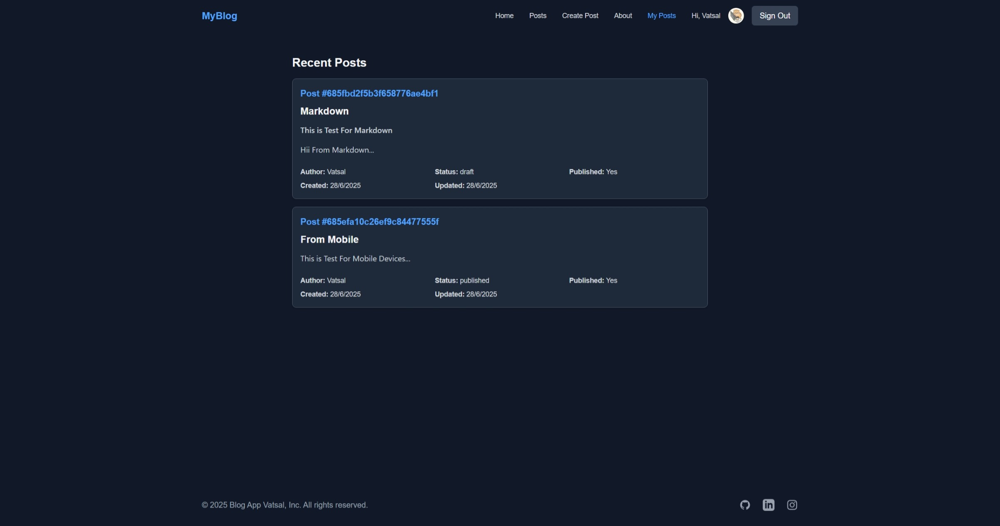

# Blog App

A modern, responsive blogging platform built with Next.js 14, MongoDB, and NextAuth. Featuring React Server Components and a hybrid architecture for optimal performance and user experience.

# /



# /create



# /post



# /mypost



## Features

-   **Dark Mode UI**: Sleek, modern interface with a dark theme
-   **User Authentication**: Secure login via Google OAuth
-   **Anonymous Posting**: Write posts without revealing your identity
-   **Interactive Comments**: Engage with other users through comments
-   **Full CRUD Operations**: Create, read, update, and delete your posts
-   **Responsive Design**: Works seamlessly on mobile, tablet, and desktop
-   **Markdown Support**: Write rich-formatted posts with Markdown
-   **Protected Routes**: Access control based on authentication status
-   **404 Error Pages**: Custom error handling for non-existent routes
-   **Server-Side Rendering**: Optimized performance with React Server Components
-   **Hybrid Architecture**: Server Components with Client Interactivity where needed
-   **Pagination**: Smart pagination for posts and comments for better UX and performance

## Architecture & Performance Optimizations

This blog platform leverages Next.js 14's modern architecture patterns for exceptional performance:

### Server Components

-   **Zero Client-Side JavaScript**: Core pages render without JS overhead
-   **Fast Initial Page Load**: Direct server rendering of main content
-   **Smaller Bundle Sizes**: Components not shipped to client unless needed
-   **SEO Optimization**: Complete content available for search engine crawlers

### Hybrid Rendering Approach

-   **Smart Component Splitting**: Server components for data and rendering, client components for interactivity
-   **Progressive Enhancement**: Core content loads instantly, interactive elements hydrate afterward
-   **Optimized Comments System**: Initial comments load server-side for SEO and fast paint, new comments added client-side for interactivity
-   **Paginated Data Loading**: Efficient loading of posts and comments in pages for better performance

### Database Optimizations

-   **Direct Database Access**: Server components connect directly to MongoDB without API overhead
-   **Lean Queries**: Using Mongoose `lean()` for faster data retrieval (up to 5x performance improvement)
-   **Optimized Indexes**: MongoDB indexes on frequently queried fields
-   **Efficient Data Patterns**: Fetching only necessary fields in queries
-   **Pagination**: Using skip/limit for efficient data access across large datasets

### Code Organization

-   **Clean Component Separation**: Clear boundaries between server and client code
-   **Modular Design**: Focused components with single responsibilities
-   **Proper Error Handling**: Graceful error management at both server and client levels
-   **Type Safety**: TypeScript throughout for robust code quality

## Tech Stack

-   **Frontend**: Next.js 14 (App Router), React, TypeScript, Tailwind CSS
-   **Backend**: Next.js API Routes, MongoDB with Mongoose
-   **Authentication**: NextAuth.js with Google OAuth
-   **Architecture**: React Server Components, Hybrid SSR + Client Components
-   **Styling**: Tailwind CSS
-   **State Management**: React Hooks
-   **Forms**: React Hook Form
-   **Markdown**: MDEditor

## Getting Started

### Prerequisites

-   Node.js 18.x or later
-   MongoDB database (local or Atlas)
-   Google OAuth credentials (for authentication)

### Installation

1. Clone the repository:

```bash
git clone https://github.com/IamVatsal/Blog_App_Nextjs.git
cd Blog_App_Nextjs
```

2. Install dependencies:

```bash
npm install
```

3. Set up environment variables:
   Create a `.env.local` file in the root directory with the following variables:

```
# MongoDB
MONGODB_URI=your-mongodb-connection=url

# NextAuth
NEXTAUTH_URL=http://localhost:3000
NEXTAUTH_SECRET=your-nextauth-secret

# Google OAuth
GOOGLE_CLIENT_ID=your-google-client-id
GOOGLE_CLIENT_SECRET=your-google-client-secret
```

> **Important Note for MongoDB Atlas Users**: Remember to whitelist your IP address in the MongoDB Atlas dashboard under Network Access. For development, you might want to allow access from anywhere (`0.0.0.0/0`), but make sure to restrict this in production.

4. Run the development server:

```bash
npm run dev
```

5. Open [http://localhost:3000](http://localhost:3000) in your browser to see the application.

## Project Structure

```
blog-app/
├── app/                   # Next.js App Router
│   ├── api/               # API routes
│   │   ├── auth/          # Authentication endpoints
│   │   ├── posts/         # Post endpoints
│   │   ├── comments/      # Comment endpoints
│   │   └── users/         # User endpoints
│   ├── about/             # About page
│   ├── create/            # Post creation page
│   ├── myposts/           # User's posts page (server component)
│   ├── posts/             # Posts listing page (server component)
│   │   └── [id]/          # Single post page (server component)
│   └── page.tsx           # Landing page
├── components/            # React components
│   ├── auth/              # Auth components
│   └── ui/                # UI components
│       ├── CommentForm.tsx  # Client component for adding comments
│       ├── CommentItem.tsx  # Component for rendering a comment
│       ├── Comments.tsx     # Client component for managing comments
│       ├── ServerComments.tsx # Server component for initial comments loading
│       ├── PostServer.tsx   # Server component for post rendering
│       ├── PostClientWrapper.tsx # Client wrapper for post editing
│       ├── FooterServer.tsx # Server component for footer
│       └── Post.tsx        # Post display component
├── lib/                   # Utilities
│   ├── mongoose.ts        # MongoDB connection
│   └── comments.ts        # Server-side comment fetching
├── models/                # Mongoose models
│   ├── comment.ts
│   ├── post.ts
│   └── user.ts
└── public/                # Static files
```

## Setting Up Authentication

1. Create a project in the [Google Cloud Console](https://console.cloud.google.com/)
2. Enable the Google OAuth API
3. Configure the OAuth consent screen
4. Create OAuth 2.0 credentials
5. Add authorized redirect URIs: `http://localhost:3000/api/auth/callback/google`
6. Copy the Client ID and Client Secret to your `.env.local` file

## Database Schema

### User

-   `_id`: MongoDB ObjectId
-   `name`: User's display name
-   `email`: User's email address (unique)
-   `avatar`: URL to user's profile picture
-   `createdAt`: Timestamp of account creation
-   `updatedAt`: Timestamp of last update

### Post

-   `_id`: MongoDB ObjectId
-   `title`: Post title
-   `content`: Markdown content
-   `author`: Author's name
-   `email`: Author's email
-   `status`: Post status (draft/published/archived)
-   `isPublished`: Boolean indicating if post is published
-   `createdAt`: Timestamp of creation
-   `updatedAt`: Timestamp of last update

### Comment

-   `_id`: MongoDB ObjectId
-   `text`: Comment text
-   `name`: Commenter's name
-   `postId`: Reference to post
-   `likes`: Number of likes
-   `createdAt`: Timestamp of creation
-   `updatedAt`: Timestamp of last update

## Server & Client Component Breakdown

This app uses a strategic mix of server and client components:

### Server Components

-   **Posts Listing**: Server-rendered for fast initial load and SEO
-   **Post Detail**: Core content server-rendered, with client interactivity for actions
-   **My Posts**: Server-rendered with session validation
-   **Initial Comments**: Server-rendered for immediate visibility and SEO

### Client Components

-   **Comment Form**: Client-side for immediate interaction without page refresh
-   **Post Editing**: Client-side for interactive editing experience
-   **Authentication UI**: Client-side for login flow
-   **Interactive Elements**: Any UI requiring event handlers or state

## Contributing

Contributions are welcome! Please feel free to submit a Pull Request.

1. Fork the repository
2. Create your feature branch (`git checkout -b feature/amazing-feature`)
3. Commit your changes (`git commit -m 'Add some amazing feature'`)
4. Push to the branch (`git push origin feature/amazing-feature`)
5. Open a Pull Request

## License

This project is licensed under the MIT License - see the LICENSE file for details.

## Acknowledgments

-   [Next.js](https://nextjs.org/) for the React framework with built-in optimizations
-   [React Server Components](https://nextjs.org/docs/app/building-your-application/rendering/server-components) for revolutionary rendering architecture
-   [Tailwind CSS](https://tailwindcss.com/) for the utility-first CSS
-   [NextAuth.js](https://next-auth.js.org/) for authentication
-   [MongoDB](https://www.mongodb.com/) for the database
-   [Mongoose](https://mongoosejs.com/) for MongoDB object modeling

---

## Created with ❤️ by Vatsal

Connect with me:

-   [GitHub](https://github.com/IamVatsal)
-   [LinkedIn](https://www.linkedin.com/in/vatsal-patel0609/)
-   [Instagram](https://www.instagram.com/vatsal06)
